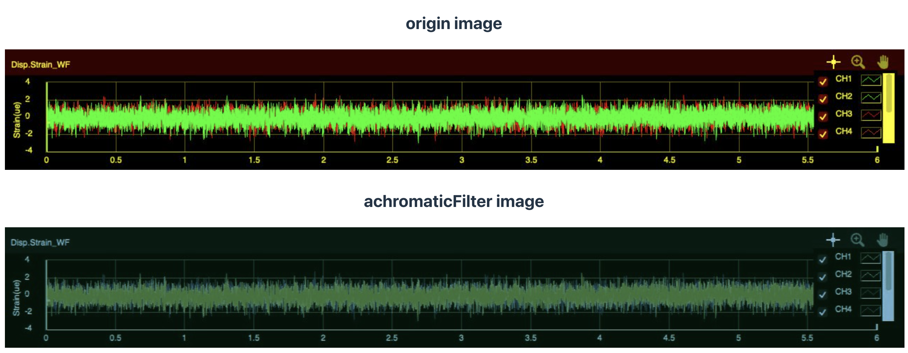

## description

The util to get image pixels data , edit martix data, output image base64.

## Install

```shell
pnpm add image-pixels-modify
```

## API

```typescript
import { modifyImage } from "image-pixels-modify";
import img from "./assets/test.jpeg";

const peelingImage = (data: Uint8ClampedArray) => {
  for (let i = 0; i < data.length; i += 4) {
    data[i + 2] = data[i];
  }
};

const base64Str = await modifyImage(url, peelingImage);
```


## Common Filters

### reverseFilter

```typescript
import { modifyImage, reverseFilter } from "image-pixels-modify";
import img from "./assets/test.jpeg";

const base64Str = await modifyImage(url, reverseFilter);
```


### achromaticFilter

```typescript
import { modifyImage, achromaticFilte } from "image-pixels-modify";
import img from "./assets/test.jpeg";

const base64Str = await modifyImage(url, achromaticFilte);
```



### comicFilter

```typescript
import { modifyImage, comicFilte } from "image-pixels-modify";
import img from "./assets/test.jpeg";

const base64Str = await modifyImage(url, comicFilte);
```

## Data API Utils

### getImageSize

to get image width and height

```typescript
import { getImageSize } from "image-pixels-modify";
import img from "./assets/test.jpeg";

const [width, height] = await getImageSize(img);
```

### normalize

imageData like [ r, g, b, a, r, g, b, a, ... ]

[0, 0, 0, 255,0, 0, 0, 255,0, 0, 0, 255,0, 0, 0, 255,...]

turn to multidimensional matrix

[

    [ [0, 0, 0, 255],  [0, 0, 0, 255], ... ] , // first line
    [ [0, 0, 0, 255],  [0, 0, 0, 255], ... ],  // second line

    ...

]

```typescript
import { normaliz, getImageDataAndCanvas } from "image-pixels-modify";
import img from "./assets/test.jpeg";
const [imageData, _canvasElement] = await getImageDataAndCanvas(img);
const matrixData = normaliz(imageData, _canvas.width, _canvas.height);
```

### restoreData

flat matrix pixels data to one dimensional array

```typescript
import {
  normaliz,
  restoreData,
  getImageDataAndCanvas,
} from "image-pixels-modify";
import img from "./assets/test.jpeg";
const [imageData, _canvasElement] = await getImageDataAndCanvas(img);
const matrixData = normaliz(imageData, _canvas.width, _canvas.height);

// todos
// handle pixels humannize

// over handle mutil matrix data, then turn into one dimension array
const recoverData = restoreData(matrixData);
```
